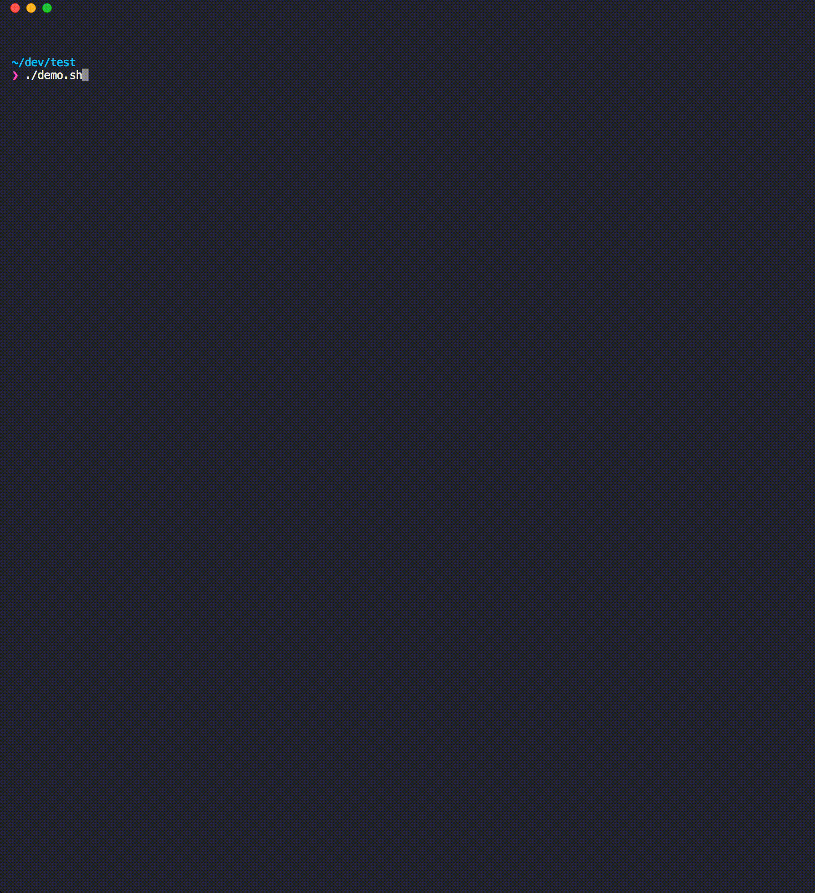

Your `package-lock.json` isn't respected when there are `^` and `~` in  your `package.json`.  Instead, npm will install the most recent version allowed by the `^` and `~`. This means that your builds are not reproducable since a dependency can upgrade and break your app without any changes made by you. 

To prove this to yourself, run the demo:

```
./demo.sh
```

Supporting information:
- A detailed writeup on this issue: https://stackoverflow.com/a/45566871/2259303



